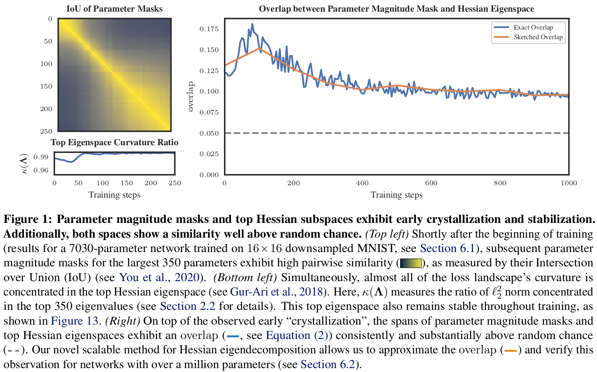

# What Apples Tell About Oranges: Connecting Parameter Magnitude Masks and Hessian Eigenspaces

This repository contains general functionality to perform sketched eigendecompositions, as well as to support the experiments done as part of the paper.




### Installation:

For deep learning numerical computations, we use [PyTorch](https://pytorch.org/) and [CurvLinOps](https://github.com/f-dangel/curvlinops). To organize the deep learning experiments, we use [DeepOBS](https://github.com/fsschneider/DeepOBS).

Installation instructions (Ubuntu):

```
conda create -n apples python==3.9
conda activate apples
#
conda install pytorch==1.13.0 torchvision==0.14.0 pytorch-cuda=11.6 -c pytorch -c nvidia
conda install -c conda-forge omegaconf==2.3.0
conda install -c conda-forge matplotlib==3.6.2
conda install -c anaconda h5py==3.7.0
conda install -c anaconda scipy==1.10.1
#
pip install 'git+https://github.com/fsschneider/DeepOBS.git@develop#egg=deepobs'
pip install coloredlogs==15.0.1
pip install curvlinops-for-pytorch
pip install torch-dct
```

A full description of the environment can be seen in [assets/requirements.txt](assets/requirements.txt).


### Running the experiments:

Code for our experiments is contained in the Jupyter notebooks and Python/SLURM scripts located at the root of the repository. Specifically:

* [01a_grassmannian_metrics.ipynb](01a_grassmannian_metrics.ipynb): This notebook contains the synthetic experiment conducted to investigate the behavior of different Grassmannian metrics, as well as the corresponding results.

* [skerch](skerch): This python library provides functionality to implement sketched matrix-free decompositions on top of PyTorch, including the `SkEIGH` routine presented in the paper.

* ...
* ...


To reproduce the results from the paper, run the corresponding notebooks/scripts. Note that some of the experiments are meant to be run on a [Slurm](https://slurm.schedmd.com/documentation.html) computational cluster, and we can not guarantee successful otherwise.


